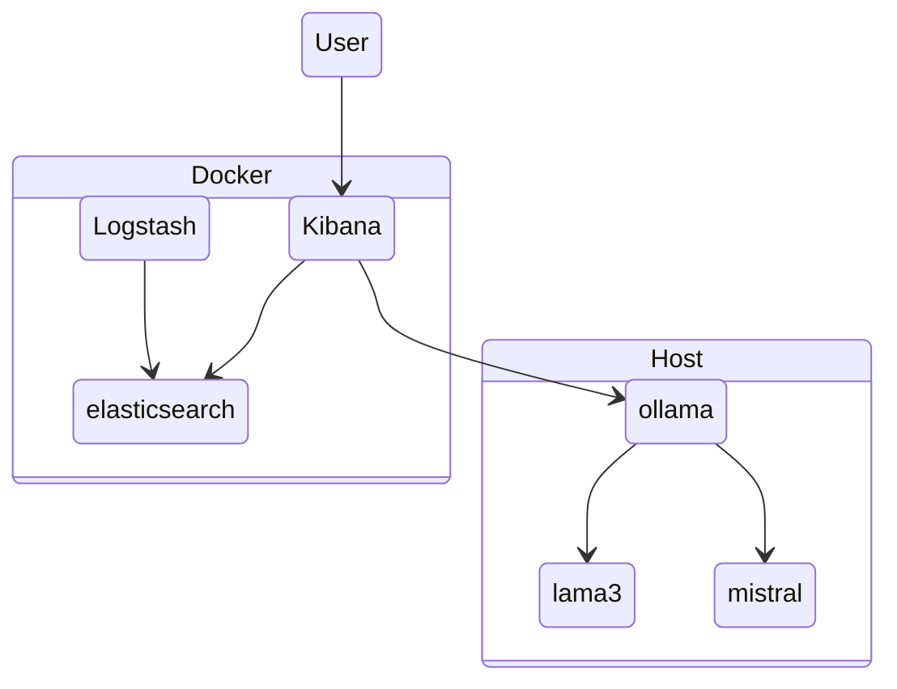
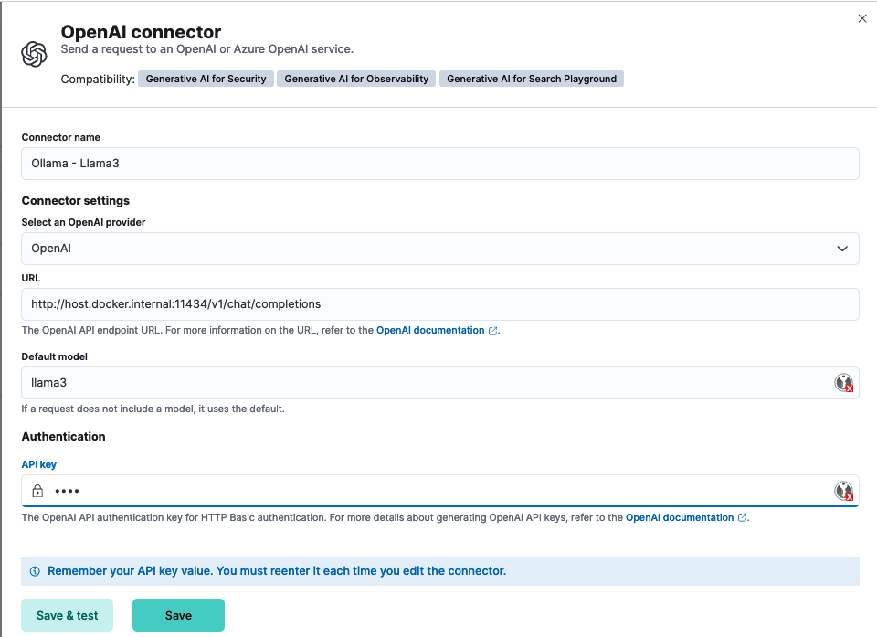
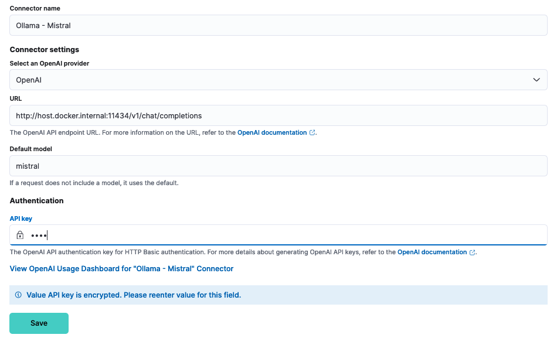

# Elastic AI Assistant with Local LLM

<!-- vscode-markdown-toc -->
* 1. [Description](#Description)
* 2. [Requirements](#Requirements)
	* 2.1. [Ollama](#Ollama)
	* 2.2. [Elastic Stack](#ElasticStack)

<!-- vscode-markdown-toc-config
	numbering=true
	autoSave=true
	/vscode-markdown-toc-config -->
<!-- /vscode-markdown-toc -->

##  1. <a name='Description'></a>Description

Leveraging local LLMs within Elastic environments ensures robust data confidentiality, as sensitive information never leaves the secure premises. Additionally, local LLMs provide faster processing times and greater control over model customization, catering to specific business needs without reliance on external servers. This setup enhances compliance with privacy regulations and minimizes the risk of data breaches.

##  2. <a name='Requirements'></a>Requirements

In the following setup we will have the following scenario running a local developpement environement :



You could adapt your architecture by running ollama directly in the docker-compose environment.

###  2.1. <a name='Ollama'></a>Ollama

1. Download & Install [Ollama](https://github.com/ollama/ollama) for your platform
2. Once started download the model you want to run.

```bash
ollama pull mistral
ollama spull llama3
```

3. Test the two models

For Llam3:

```bash
curl http://localhost:11434/v1/chat/completions \
    -H "Content-Type: application/json" \
    -d '{
        "model": "llama3",
        "messages": [
            {
                "role": "system",
                "content": "You are a helpful assistant."
            },
            {
                "role": "user",
                "content": "Hello!"
            }
        ]
    }'

```

For Mistral:

```bash
curl http://localhost:11434/v1/chat/completions \
    -H "Content-Type: application/json" \
    -d '{
        "model": "mistral",
        "messages": [
            {
                "role": "system",
                "content": "You are a helpful assistant."
            },
            {
                "role": "user",
                "content": "Hello!"
            }
        ]
    }'

```

**_NOTE:_** If your Ollama server is running on a separated server, you will have to change the listen port to listen on all interface. for example on a Mac :

```bash
    launchctl setenv OLLAMA_HOST "0.0.0.0"
```

and restart Ollama application.

For more information please refer to the Ollama [documentation](https://github.com/ollama/ollama/blob/main/docs/faq.md#how-do-i-configure-ollama-server)

###  2.2. <a name='ElasticStack'></a>Elastic Stack

1. Install Elastic stack

For the purpose of this setup we will use [docker-elk](https://github.com/deviantony/docker-elk) as a base.

simply clone the repository and start the stack

```bash
git clone git@github.com:deviantony/docker-elk.git
docker compose up -d
```

2. Configure the stack

In order to be able to use Kibana connectors, you will need to generate encryption keys from kibana docker and add them to _kibana.yml_

```bash
docker exec -ti docker-elk-kibana-1 bash
kibana@1d5263e8d004:~$ bin/kibana-encryption-keys generate 
Settings:
xpack.encryptedSavedObjects.encryptionKey: <GENERATED_ENCRYPTEDSAVEDOBJECTS.ENCRYPTIONKEY_VALUE>
xpack.reporting.encryptionKey: <GENERATED_REPORTING.ENCRYPTIONKEY_VALUE>
xpack.security.encryptionKey: <GENERATED_SECURITY.ENCRYPTIONKEY_VALUE>

```

and add the values to _kibana/config/kibana.yml_ of the docker compose file :

```bash
xpack.encryptedSavedObjects.encryptionKey: <GENERATED_ENCRYPTEDSAVEDOBJECTS.ENCRYPTIONKEY_VALUE>
xpack.reporting.encryptionKey: <GENERATED_REPORTING.ENCRYPTIONKEY_VALUE>
xpack.security.encryptionKey: <GENERATED_SECURITY.ENCRYPTIONKEY_VALUE>
```

Finally restart the stack

```bash
docker compose restart
```

For more information about please refer to the Elastic [documentation](https://www.elastic.co/guide/en/kibana/8.14/kibana-encryption-keys.html)

3. Create the connectors

Finally you can create the connectors within Kibana UI. For this go to _Stack Management -> Connectors -> Create connector -> OpenAI_

Connectors are handled by Kibana, which in our case, is executed instide a docker and need to interact with Ollama, executed on the host. For Kibana to reach out to Ollama, we will need to use the following host : _host.docker.internal_

For Llama3 this will look like this :


For Mistral this will look like this :


**_NOTE:_**  For more information on the _host.docker.internal_ please refer to the docker [documentation](https://docs.docker.com/desktop/networking/#i-want-to-connect-from-a-container-to-a-service-on-the-host)

You can now enjoy your local LLM instance within the Elastic AI Assistant

Recording video  
[](http://www.youtube.com/watch?v=YOUTUBE_VIDEO_ID_HERE "Video Title")